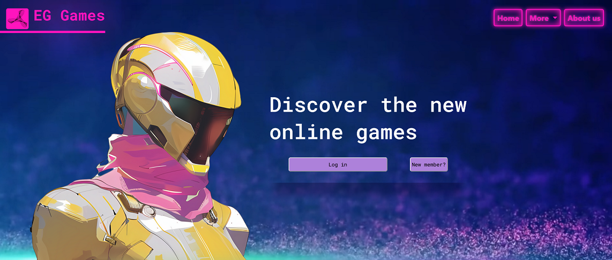

 # 🟣 $\textsf{\color{#a832a4}{EG Games}}$ 🟣

Imaginary game company platform using Bootstrap.

This project represents how to:
* make carousel
* make cards
* nav
* dropdown
* multiple pages
* collapse ( nav to hamburger icon, content under title and button [see page 2])
* form 

Here is the link to the page:

https://kaunfell.github.io/Game-Company/

--------------
Images and videos are from open libraries, see more on [resources.txt](./resurssit/resources.txt)